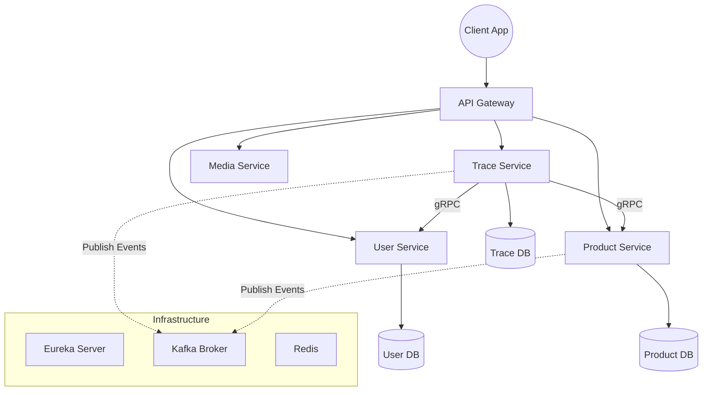
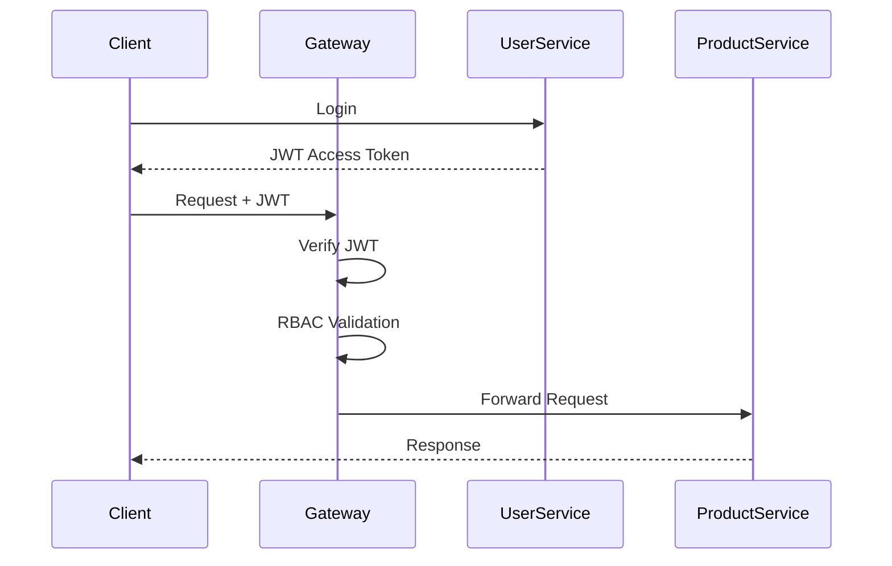

# AgriTrace

> Hệ thống Microservices truy xuất nguồn gốc nông sản với cơ chế chống giả mạo dữ liệu lấy cảm hứng từ Blockchain.


## Tổng quan

**AgriTrace** là đồ án tốt nghiệp được xây dựng nhằm giải quyết bài toán minh bạch chuỗi cung ứng nông sản thông qua kiến trúc **Microservices** kết hợp các cơ chế đảm bảo tính toàn vẹn dữ liệu như:

- SHA-256 Hash Chaining
- RSA Digital Signature
- Immutable Audit Ledger (WORM)
- GPS Geofencing Validation

Khác với các hệ thống CRUD thông thường, AgriTrace được thiết kế theo hướng:

- khó giả mạo dữ liệu
- dễ audit lịch sử thay đổi
- hỗ trợ truy vết xuyên suốt vòng đời sản phẩm
- sẵn sàng mở rộng theo mô hình distributed system

Dự án đồng thời là portfolio backend engineering để ứng tuyển vị trí **Junior Java Backend Developer**.

---

# Bài toán thực tế

Trong chuỗi cung ứng nông sản, dữ liệu thường bị:

- chỉnh sửa thủ công sau khi nhập
- thiếu khả năng truy vết nguồn gốc
- khó xác minh vị trí canh tác thực tế
- thiếu cơ chế audit lịch sử thay đổi

Điều này khiến:

- người tiêu dùng thiếu niềm tin
- doanh nghiệp khó kiểm định chất lượng
- khó xác định trách nhiệm khi xảy ra sự cố thực phẩm

AgriTrace được xây dựng để giải quyết các vấn đề trên bằng tư duy của một hệ thống backend production-oriented.

---

# Highlights

## Backend Engineering Highlights

- Kiến trúc Microservices với Database-per-Service
- gRPC communication cho internal services
- Kafka Event-Driven Audit Logging
- JWT Stateless Authentication
- RBAC Authorization
- Hash Chain chống chỉnh sửa dữ liệu hồi tố
- RSA Signature chống giả mạo log
- Geofencing Validation bằng công thức Haversine
- Dockerized Distributed Environment
- Fault-tolerant design với Eureka + Resilience4j

---

# System Architecture



## Kiến trúc tổng thể

Hệ thống được thiết kế theo mô hình:

- **API Gateway Pattern** cho centralized routing & security
- **Service Discovery** bằng Netflix Eureka
- **Database-per-Service** để giảm coupling
- **Event-Driven Architecture** cho audit logging
- **gRPC Internal Communication** nhằm tối ưu latency

Việc lựa chọn Microservices giúp:

- independent deployment
- horizontal scaling
- fault isolation
- maintainability tốt hơn khi hệ thống mở rộng

---

# Microservices Breakdown

| Service | Responsibility |
|---|---|
| API Gateway | Routing, JWT Validation, Security Filtering |
| Eureka Server | Service Discovery |
| User Service | Authentication, RBAC, RSA Key Management |
| Product Service | Product & Batch Management |
| Trace Service | Trace Logging, Hash Chain, Geofencing |
| Media Service | QR Code & Media Processing |
| Audit Service | Kafka Consumer & Immutable Audit Ledger |

---

# Security & Data Integrity Design

Đây là phần cốt lõi làm AgriTrace khác biệt với các project CRUD thông thường.

## 1. Hash Chaining

Mỗi Trace Log sẽ chứa:

- `previous_hash`
- `current_hash`

`current_hash` được tạo bằng:

```text
SHA256(trace_data + previous_hash)
```

Điều này tạo thành chuỗi liên kết dữ liệu.

Nếu một bản ghi bị chỉnh sửa trực tiếp trong database:

- hash hiện tại sẽ thay đổi
- toàn bộ chuỗi phía sau bị invalid
- hệ thống phát hiện dữ liệu đã bị can thiệp

---

## 2. RSA Digital Signature

Sau khi tạo hash:

- hệ thống ký `current_hash` bằng RSA Private Key
- lưu `signature` vào Trace Log
- verify bằng Public Key khi đọc dữ liệu

---

## 3. Immutable Audit Ledger (WORM)

Mọi thay đổi trạng thái hệ thống đều publish event vào Kafka.

Audit Service consume và ghi vào audit ledger theo cơ chế:

> Write Once Read Many

Không tồn tại API UPDATE hoặc DELETE cho audit data.

---

## 4. Geofencing Validation

Khi Farmer ghi nhật ký canh tác:

- thiết bị gửi GPS coordinates
- hệ thống tính khoảng cách bằng Haversine Formula
- validate theo business rules

Nếu vượt quá giới hạn:

```text
GeofenceViolationException
```

---

# Authentication Flow



---

# Tech Stack

## Backend

- Java 21
- Spring Boot 3.3.6
- Spring Security
- Spring Cloud Gateway
- Spring Data JPA
- Spring Cloud Netflix Eureka
- Resilience4j

## Infrastructure

- PostgreSQL
- Redis
- Apache Kafka
- Docker
- Docker Compose

## Communication

- REST API
- gRPC
- Kafka Event Streaming

---

# Engineering Challenges

## Distributed Transaction Problem

Giải quyết vấn đề consistency giữa nhiều services bằng:

- Soft Delete
- Cross-service validation bằng gRPC
- Historical data protection

## Detecting Tampered Data

Nếu DBA sửa trực tiếp database:

- Hash Chain bị đứt
- Signature verification fail
- hệ thống đánh dấu `COMPROMISED`

---

# Scalability Considerations

- Stateless API Gateway
- Horizontal scaling
- Kafka async processing
- Database-per-Service isolation
- Read replica ready

---

# Local Development Setup

## Requirements

- Java 21
- Maven
- Docker
- Docker Compose

## Run Project

```bash
git clone https://github.com/your-username/AgriTraceChain.git

cd agritrace-microservices

mvn clean install -DskipTests

docker-compose up -d
```

---

# Future Improvements

- Kubernetes Deployment
- CI/CD Pipeline với GitHub Actions
- ElasticSearch/OpenSearch Audit Analytics
- Real-time Notification System
- Distributed Tracing Dashboard

---

# What I Learned

- Distributed System Design
- Event-Driven Architecture
- gRPC & Kafka Communication
- JWT Security & RBAC
- Applied Cryptography
- Dockerized Infrastructure

---

# Author

**Role:** Backend Developer / System Designer

- GitHub: [your-github]
- LinkedIn: [your-linkedin]
- Email: [your-email]

---

> “Good architecture is not about complexity. It's about designing systems that remain trustworthy as they scale.”
