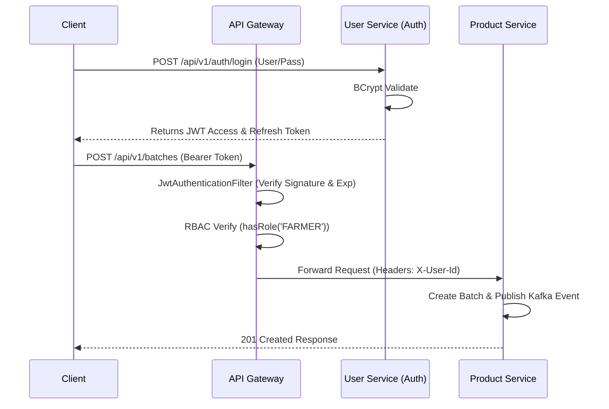
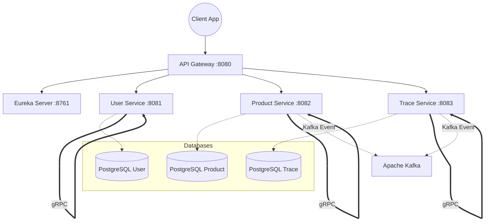
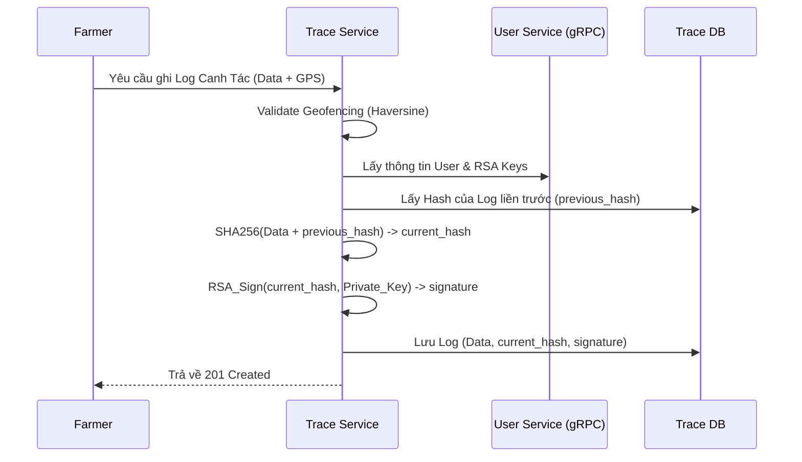

# AgriTrace - Hệ Thống Microservices Truy Xuất Nguồn Gốc Nông Sản


## 1. Giới thiệu dự án
**AgriTrace** là một hệ thống phần mềm phân tán (Distributed System) được xây dựng dựa trên kiến trúc Microservices nhằm quản lý và minh bạch hóa chuỗi cung ứng nông sản. Hệ thống cho phép truy vết xuyên suốt vòng đời của sản phẩm từ khâu xuống giống, canh tác, thu hoạch cho đến đóng gói và kiểm định. Bằng việc áp dụng các cơ chế mật mã học (Cryptography) lấy cảm hứng từ Blockchain, AgriTrace đảm bảo tính bất biến (immutability) và tính xác thực (authenticity) của mọi dữ liệu được ghi nhận.

## 2. Bài toán thực tế
Trong chuỗi cung ứng nông sản hiện đại, bài toán "niềm tin" là thách thức lớn nhất. Người tiêu dùng và các cơ quan kiểm định gặp khó khăn trong việc:
* Xác minh nguồn gốc thực sự của sản phẩm.
* Đảm bảo nhật ký canh tác (bón phân, phun thuốc) không bị làm giả hoặc sửa đổi hồi tố (retroactive modification).
* Xác định vị trí địa lý thực tế nơi sản phẩm được trồng trọt.
* Truy vết trách nhiệm (Root Cause Analysis - RCA) khi có sự cố về an toàn thực phẩm.

## 3. Mục tiêu hệ thống
* **Tính minh bạch:** Cung cấp thông tin truy xuất qua QR Code cho người dùng cuối.
* **Tính toàn vẹn (Data Integrity):** Ngăn chặn mọi hành vi can thiệp, chỉnh sửa dữ liệu trái phép kể cả từ cấp độ Database Administrator.
* **Tính quy trách nhiệm (Non-repudiation):** Gắn chặt trách nhiệm của từng cá nhân (Nhà vườn, Thanh tra) thông qua chữ ký số.
* **Hiệu năng & Khả năng mở rộng (Scalability):** Thiết kế kiến trúc chịu tải cao, sẵn sàng mở rộng theo chiều ngang (Horizontal Scaling).

## 4. Tổng quan kiến trúc hệ thống
Hệ thống AgriTrace được thiết kế theo mô hình **Event-Driven Microservices Architecture**. Các domain nghiệp vụ được phân tách thành các service độc lập (User, Product, Trace) tuân thủ nguyên tắc **Database-per-service** nhằm đảm bảo tính lỏng lẻo (loose coupling). Giao tiếp ngoại vi (Client) được xử lý thông qua API Gateway, trong khi giao tiếp nội bộ (Internal) sử dụng **gRPC** để tối ưu hóa độ trễ (latency) và **Kafka** cho các tác vụ bất đồng bộ (Asynchronous/Audit).

## 5. Kiến trúc Microservices
Việc lựa chọn Microservices mang lại sự độc lập trong quá trình phát triển và triển khai (Independent Deployability). Mỗi service quản lý một Bounded Context riêng biệt, giúp hệ thống không bị sụp đổ toàn bộ (Single Point of Failure) khi một thành phần gặp sự cố. Hệ thống tích hợp **Netflix Eureka** làm Service Discovery và **Resilience4j** làm Circuit Breaker để tăng tính chống chịu (Fault Tolerance).

## 6. Danh sách các service và chức năng

| Tên Service | Port (Public/Mgmt) | Trách nhiệm (Responsibility) |
| :--- | :--- | :--- |
| **API Gateway** | 8080 / 9080 | Entry point, Edge Routing, JWT Authentication, Rate Limiting. |
| **Eureka Server** | 8761 / 9761 | Service Registry & Discovery. |
| **User Service** | 8081 / 9091 | Quản lý định danh (Identity), RBAC, Quản lý Khóa bảo mật (RSA Keys), Nông trại. |
| **Product Service**| 8082 / 9092 | Quản lý danh mục Nông sản, Quản lý Lô hàng (Batches). |
| **Trace Service** | 8083 / 9093 | Ghi nhận Nhật ký canh tác, Xử lý Hash Chaining, Ký số RSA, Geofencing. |
| **Media Service** | 8084 / 9084 | Khởi tạo QR Code, Xử lý hình ảnh đính kèm. |
| **Audit Service*** | N/A (Kafka) | Tiêu thụ Kafka Event, ghi sổ cái WORM (Write-Once-Read-Many) chống chối bỏ. |

*(Chú thích: Audit Service là Logical component tiêu thụ Kafka message).*

## 7. Các tính năng chính
* **Quản trị (Admin):** Quản lý người dùng, danh mục nông sản, giám sát hệ thống.
* **Nhà vườn (Farmer):** Tạo lô hàng, cập nhật nhật ký canh tác (xuống giống, bón phân, thu hoạch, đóng gói) kèm tọa độ GPS.
* **Kiểm định (Inspector):** Phê duyệt lô hàng, xác nhận chất lượng.
* **Khách hàng (Public):** Quét mã QR, xem hành trình nông sản (Trace Journey Map) và kiểm tra tính hợp lệ của chữ ký số.

## 8. Cơ chế bảo mật
* **Edge Security:** Chặn request trực tiếp vào các microservices. Mọi traffic phải đi qua API Gateway.
* **Stateless Authentication:** Sử dụng JWT với vòng đời ngắn (Access Token: 15 phút) kết hợp Refresh Token Rotation.
* **Xác thực phi tập trung:** API Gateway trực tiếp parse và validate JWT Signature (không gọi DB), sau đó inject thông tin User/Role vào Header (ví dụ: `X-User-Id`, `X-User-Role`) để truyền xuống các downstream services.

## 9. Cơ chế đảm bảo toàn vẹn dữ liệu
AgriTrace áp dụng triết lý thiết kế **"Blockchain-Like"**. Khác với các hệ thống CRUD thông thường, dữ liệu của AgriTrace có tính Append-Only. Bất kỳ nỗ lực sửa đổi dữ liệu trực tiếp dưới Database đều sẽ làm phá vỡ cấu trúc mật mã của toàn bộ hệ thống.

## 10. Cơ chế Hash Chaining
* Mỗi bản ghi (Trace Log) sẽ chứa một mã băm `current_hash` (sử dụng thuật toán **SHA-256**).
* Giá trị đầu vào để băm bao gồm: Data Payload + `previous_hash` (mã băm của bản ghi liền trước).
* **Kết quả:** Tạo thành một chuỗi mắt xích liên kết (Hash Chain). Nếu một kẻ gian lận (hoặc DBA) can thiệp sửa đổi nội dung của `Log #2`, `current_hash` của `Log #2` sẽ thay đổi, kéo theo sự không khớp với `previous_hash` của `Log #3`, làm toàn bộ phần còn lại của chuỗi bị vô hiệu hóa (Gắn cờ `COMPROMISED`).

## 11. Cơ chế RSA Digital Signature
Để ngăn chặn việc kẻ tấn công tính toán lại (re-hash) toàn bộ chuỗi sau khi sửa dữ liệu:
* Mỗi khi Farmer hoặc Inspector tạo Trace Log, hệ thống yêu cầu họ "Ký số" (Sign) lên `current_hash` bằng **Private Key** (RSA 2048-bit).
* Hệ thống sinh ra một `signature` và lưu vào bản ghi.
* Khi dữ liệu được truy xuất, Trace Service sẽ dùng **Public Key** của người dùng đó để Verify (Xác minh) chữ ký. Điều này mang lại tính Non-repudiation (Không thể chối bỏ trách nhiệm).

## 12. Audit Ledger / WORM Design
* **WORM (Write-Once-Read-Many):** Mọi hành động làm thay đổi trạng thái hệ thống (Tạo Lô hàng, Cập nhật Nhật ký) đều sinh ra các sự kiện (Events).
* Hệ thống sử dụng `KafkaTemplate` để đẩy các Before/After Snapshots vào topic `audit-ledger-topic`.
* Dữ liệu này được lưu trữ vĩnh viễn và không cung cấp API để UPDATE hay DELETE, phục vụ tuyệt đối cho quá trình Auditing (Kiểm toán).

## 13. Workflow Geofencing
Nhằm chống gian lận vị trí (ví dụ: Farmer ở thành phố nhưng lại log dữ liệu đang bón phân ở nông trại):
* Khi tạo Farm, hệ thống bắt buộc lưu trữ tọa độ gốc (Latitude, Longitude).
* Tại thời điểm ghi Trace Log, tọa độ GPS thực tế của thiết bị được gửi lên.
* Trace Service sử dụng công thức **Haversine** để tính toán khoảng cách (Distance).
* **Business Rules chặn chéo:** Hành động Canh tác (Bón phân, Tưới nước) phải nằm trong bán kính `< 5km`. Hành động Đóng gói (Packaging) hoặc Kiểm định phải `< 20km`. Nếu vi phạm, hệ thống ném ra `Geofence Violation Exception`.

## 14. Luồng xử lý nghiệp vụ
* **Validation đa chiều:** Ngoài không gian (Geofencing), hệ thống chặn chéo theo thời gian (Temporal Check) và sản lượng (Quantity).
* Không thể log hành động Canh tác nếu trạng thái đã là Thu hoạch (`HARVESTING`).
* **Sản lượng:** Số lượng xuất kho (Shipping) hoặc Đóng gói (Packaging) bị chặn tuyệt đối nếu vượt quá tổng sản lượng đã khai báo thu hoạch, chấm dứt tình trạng "trộn hàng" hay "bơm khống".

## 15. Tech Stack
* **Ngôn ngữ:** Java 21, JavaScript.
* **Backend Framework:** Spring Boot 3.3.6, Spring Cloud (Gateway, Netflix Eureka), Spring Data JPA.
* **Frontend Framework:** ReactJS, Vite, Tailwind CSS (hoặc custom CSS framework của dự án).
* **Database & Cache:** PostgreSQL 15, Redis 7.
* **Message Broker:** Apache Kafka.
* **RPC:** gRPC (Protobuf).
* **Observability:** Micrometer, Zipkin, Prometheus, Grafana.
* **Security:** Spring Security, io.jsonwebtoken, Java Security Crypto (RSA, SHA-256).
* **DevOps:** Docker, Docker Compose, Maven.

## 16. Database Design
* Thiết kế **Database-Per-Service**: Tách biệt `user_db`, `product_db`, `trace_db`.
* Không sử dụng Foreign Key cứng giữa các database. Liên kết dữ liệu dựa trên UUID.
* Schema tuân thủ chuẩn lưu trữ mã hóa (Ví dụ: `private_key_encrypted`, `public_key`).

## 17. API Design
* Tuân thủ tiêu chuẩn **RESTful API**.
* Trả về chuẩn JSON định dạng thống nhất bằng `GlobalExceptionHandler`.
* Các API nội bộ giữa các service được loại bỏ HTTP overhead bằng cách giao tiếp trực tiếp qua **gRPC**.

## 18. Authentication & Authorization Flow


## 19. Giao tiếp giữa các service
```mermaid
graph TD
    GW[API Gateway] -->|REST| TS(Trace Service)
    GW -->|REST| PS(Product Service)
    
    TS -->|gRPC (Sync)| US(User Service)
    TS -->|gRPC (Sync)| PS
    
    TS -->|Kafka (Async)| AS[Kafka Broker: audit-topic]
    PS -->|Kafka (Async)| AS
```
* **Synchronous (gRPC):** Dùng khi một service cần dữ liệu ngay lập tức để quyết định logic (Ví dụ: Trace Service cần gọi User Service để lấy thông tin Public Key, hoặc gọi Product Service để verify Owner của Farm).
* **Asynchronous (Kafka):** Dùng khi việc xử lý không chặn luồng chính (Fire-and-forget), ví dụ như ghi Audit Log.

## 20. Docker & Deployment
Hệ thống sử dụng Docker Compose để orchestration môi trường cục bộ.
* Network nội bộ: `agritrace-network`.
* 11 Containers bao gồm: 5 Microservices, 3 Postgres Databases, 1 Redis, 1 Kafka, 1 Zookeeper.
* RAM Optimization: Cấu hình `JAVA_OPTS="-Xmx256m -Xms128m"` để giới hạn memory heap, giúp toàn bộ cụm Microservices chạy mượt mà trên môi trường máy tính cá nhân (8GB RAM).

## 21. Hướng dẫn chạy local
**Yêu cầu:** Đã cài đặt Docker, Docker Compose, Java 21, Maven.
```bash
# 1. Clone repository
git clone https://github.com/your-username/AgriTraceChain.git
cd AgriTraceChain

# 2. Build toàn bộ source code
cd agritrace-microservices
mvn clean install -DskipTests

# 3. Khởi động hạ tầng (Databases, Kafka, Redis, Eureka)
docker-compose up -d postgres-user postgres-product postgres-trace redis zookeeper kafka eureka-server

# 4. Khởi động các Microservices
docker-compose up -d api-gateway user-service product-service trace-service media-service
```

## 22. Environment Variables
Một số biến môi trường cốt lõi được cấu hình qua file `.env` hoặc `application.yml`:
* `JWT_SECRET`: Secret key (256-bit) cho chữ ký JWT.
* `KAFKA_BOOTSTRAP_SERVERS`: Địa chỉ Kafka Broker (mặc định `localhost:9092`).
* `EUREKA_CLIENT_SERVICEURL_DEFAULTZONE`: `http://localhost:8761/eureka/`.
* `TRACE_GEOFENCE_DEFAULT_RADIUS_KM`: Bán kính cho phép (mặc định: `5.0`).

## 23. Hướng dẫn build & run
Dự án sử dụng cơ chế multi-module Maven.
* `agritrace-protos`: Chứa file `.proto` sinh mã gRPC Stub chung cho toàn bộ hệ thống. (Nên chạy `mvn clean install` module này trước tiên).
* Các module con: `api-gateway`, `eureka-server`, `user-service`,... tự động nhận file build.

## 24. Ví dụ API Requests
Tạo nhật ký canh tác (Gửi qua API Gateway):
```bash
curl -X POST http://localhost:8080/api/v1/traces \
  -H "Authorization: Bearer <YOUR_FARMER_JWT_TOKEN>" \
  -H "Content-Type: application/json" \
  -d '{
    "batchId": "550e8400-e29b-41d4-a716-446655440000",
    "action": "FERTILIZING",
    "quantity": 10.5,
    "latitude": 11.9404,
    "longitude": 108.4583,
    "notes": "Bón phân NPK chuẩn VietGAP"
  }'
```

## 25. Mermaid Architecture Diagram


## 26. Sequence Diagram (Luồng Ghi Dữ Liệu Bất Biến)


## 27. Các quyết định kỹ thuật quan trọng (Engineering Trade-offs)
* **gRPC vs REST cho Internal Sync:** Chọn gRPC thay vì REST/Feign Client. Bù lại việc setup phức tạp hơn (Protobuf), gRPC mang lại tốc độ Serialize/Deserialize bằng Binary cực nhanh, giảm Latency xuống mức tối thiểu trong luồng xử lý Validation chéo giữa Trace và User.
* **DB-Per-Service vs Shared DB:** Chấp nhận rủi ro dữ liệu không đồng nhất (Eventual Consistency) để đổi lấy khả năng Independent Scaling. Việc đồng bộ ID và thông tin Snapshot được thực hiện gián tiếp.
* **Kafka cho Audit Ledger:** Ghi Sổ cái Kiểm toán là thao tác rất nặng (cần serialize snapshot json). Nếu thực hiện đồng bộ sẽ làm nghẽn API chính. Đẩy qua Kafka (Fire-And-Forget) giúp trải nghiệm người dùng không bị chậm đi.

## 28. Khó khăn và hướng giải quyết
* **Bài toán Distributed Transaction:** Khi API xóa một Farm ở User Service, làm sao để xóa Batch ở Product Service?
  * *Giải pháp:* Thiết kế hệ thống theo hướng **Soft Delete** hoặc không cho phép xóa nếu đã phát sinh Batch (Check constraints via gRPC). Dữ liệu truy xuất nguồn gốc mang tính lịch sử (Historical), do đó quy định nghiệp vụ là cấm xóa vĩnh viễn (Hard Delete).
* **Đứt gãy Hash Chain (Broken Chain):** Khi dữ liệu bị DBA sửa dưới DB.
  * *Giải pháp:* Hàm `verifyTraceLogIntegrity` sẽ được gọi tự động ở truy vấn Read. Hệ thống phát hiện hash mismatches và chặn hiển thị dữ liệu ra cộng đồng (đánh cờ `COMPROMISED`), bảo vệ danh tiếng nền tảng.

## 29. Khả năng mở rộng hệ thống (Scalability)
* API Gateway cấu hình Stateless, có thể nhân bản lên N instances và điều phối bằng Nginx/HAProxy.
* Database PostgreSQL được tối ưu Indexing cho các câu lệnh query theo `batchId` và `createdAt`. Sẵn sàng áp dụng Read Replicas.

## 30. Hướng phát triển tương lai
* Triển khai ElasticSearch / OpenSearch kết hợp với Audit Service để xây dựng Dashboard Phân tích Log.
* Thêm tính năng Notification (WebSocket/SSE) khi hệ thống phát hiện có nỗ lực làm giả mạo dữ liệu (Hash Compromised Alert).
* Xây dựng luồng CI/CD Pipelines bằng GitHub Actions và deploy lên hạ tầng Kubernetes (K8s).

## 31. Kiến thức & kỹ năng đạt được
Thông qua dự án, tôi đã chứng minh và hoàn thiện các kỹ năng của một Backend Engineer:
* Làm chủ hệ sinh thái **Spring Boot / Spring Cloud**.
* Tư duy thiết kế hệ thống phân tán (Distributed System Design).
* Xử lý độ trễ và đồng bộ dữ liệu bằng **gRPC** & **Kafka**.
* Am hiểu sâu sắc về mật mã học ứng dụng (Applied Cryptography: RSA, SHA-256) và Data Security.
* Kỹ năng DevOps cơ bản (Dockerization, Networking).

## 32. Giá trị Portfolio
Dự án không chỉ là một ứng dụng CRUD đơn thuần. Việc thiết kế cơ chế **Hash Chaining, Geofencing, ABAC Authorization** đòi hỏi tư duy lập trình logic phức tạp và khả năng xử lý bài toán thực tế của doanh nghiệp. Nó chứng minh sự sẵn sàng của tôi cho các môi trường Production có tính khắt khe về toàn vẹn dữ liệu.

## 33. Thông tin tác giả
* **Vai trò:** Backend Developer / System Architect
* **Contact:** [Chèn link LinkedIn/Email của bạn]
* **GitHub:** [Chèn link GitHub của bạn]

---
*“Good code is its own best documentation, but great architecture scales businesses.”*
