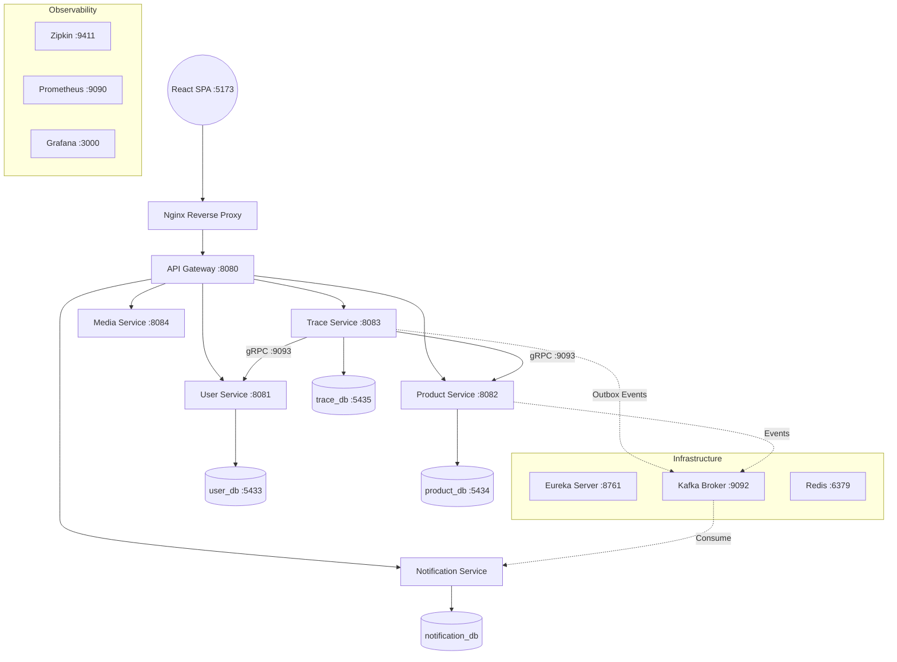
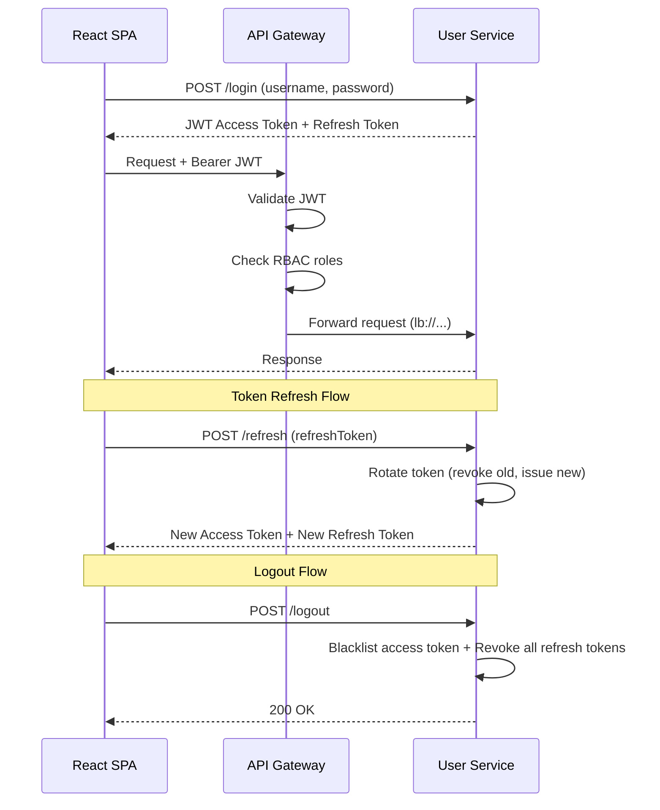

# AgriTrace

> Hệ thống Full-Stack Microservices truy xuất nguồn gốc nông sản với cơ chế chống giả mạo dữ liệu lấy cảm hứng từ Blockchain.


---

## Tổng quan

**AgriTrace** là đồ án tốt nghiệp xây dựng hệ thống **Full-Stack Microservices** giải quyết bài toán minh bạch chuỗi cung ứng nông sản. Hệ thống kết hợp các cơ chế đảm bảo tính toàn vẹn dữ liệu:

- **SHA-256 Hash Chaining** – chuỗi liên kết mật mã chống chỉnh sửa hồi tố
- **RSA 2048-bit Digital Signature** – chữ ký số chống giả mạo và chống chối bỏ
- **Immutable Audit Ledger (WORM)** – sổ cái kiểm toán bất biến
- **GPS Geofencing Validation** – xác thực vị trí canh tác bằng công thức Haversine
- **Anomaly Detection** – phát hiện bất thường tự động trong nhật ký truy vết

Khác với các hệ thống CRUD thông thường, AgriTrace được thiết kế theo hướng:

- Khó giả mạo dữ liệu (Tamper-Resistant)
- Dễ audit lịch sử thay đổi (Auditable)
- Hỗ trợ truy vết xuyên suốt vòng đời sản phẩm (End-to-End Traceability)
- Sẵn sàng mở rộng theo mô hình distributed system (Scalable)

Dự án đồng thời là portfolio **Full-Stack Engineering** để ứng tuyển vị trí **Junior Java Backend Developer**.

---

## Bài toán thực tế

Trong chuỗi cung ứng nông sản, dữ liệu thường bị:

- Chỉnh sửa thủ công sau khi nhập
- Thiếu khả năng truy vết nguồn gốc
- Khó xác minh vị trí canh tác thực tế
- Thiếu cơ chế audit lịch sử thay đổi

Điều này khiến:

- Người tiêu dùng thiếu niềm tin
- Doanh nghiệp khó kiểm định chất lượng
- Khó xác định trách nhiệm khi xảy ra sự cố thực phẩm

AgriTrace được xây dựng để giải quyết các vấn đề trên bằng tư duy của một hệ thống **production-oriented**.

---

## Điểm nổi bật

### Backend

- Kiến trúc Microservices với Database-per-Service (4 database riêng biệt)
- gRPC communication cho internal services (4 proto, 67+ generated classes)
- Kafka Event-Driven Audit Logging với Transactional Outbox Pattern
- JWT Stateless Authentication + Refresh Token Rotation
- RBAC Authorization (Admin, Farmer, Inspector)
- Hash Chain chống chỉnh sửa dữ liệu hồi tố (SHA-256)
- RSA 2048-bit Digital Signature chống giả mạo log
- Geofencing Validation bằng công thức Haversine
- Anomaly Detection Service tự động phát hiện bất thường
- Kill Switch chặn truy cập lô hàng bị can thiệp (trả 404)
- Health Score Dashboard với Redis Cache (99% giảm query)
- Dockerized Distributed Environment (11+ containers)
- Fault-tolerant design với Eureka + Resilience4j Circuit Breaker
- Centralized Exception Handling (GlobalExceptionHandler)
- Unit Tests (JUnit 5 + Mockito)

### Frontend

- Single Page Application (React 19 + Vite)
- Tailwind CSS responsive design
- Zustand state management
- Role-based UI (Consumer, Farmer, Inspector, Admin)
- Bản đồ tọa độ nhật ký (Leaflet + TraceJourneyMap)
- QR Scanner tích hợp camera (html5-qrcode)
- Hệ thống thông báo thời gian thực (BroadcastChannel API + localStorage)
- Đa ngôn ngữ i18n (Tiếng Việt, English)
- E2E Testing (Playwright)
- Framer Motion micro-animations
- Toast notification system
- Location Picker component tích hợp bản đồ

### DevOps & Testing

- Docker Compose multi-environment (dev + prod)
- Nginx reverse proxy với SSL
- Kubernetes manifests (Namespace, ConfigMap, Secret, Services)
- Load Testing với K6
- E2E Testing với Playwright
- Prometheus + Grafana monitoring
- Distributed Tracing với Zipkin

---

## Kiến trúc hệ thống



### Kiến trúc tổng thể

Hệ thống được thiết kế theo mô hình:

- **API Gateway Pattern** cho routing tập trung, JWT validation và rate limiting
- **Service Discovery** bằng Netflix Eureka cho dynamic routing
- **Database-per-Service** đảm bảo loose coupling giữa các service
- **Event-Driven Architecture** (Kafka) cho audit logging bất đồng bộ
- **Transactional Outbox Pattern** đảm bảo at-least-once delivery cho Kafka events
- **gRPC** cho giao tiếp nội bộ tối ưu độ trễ
- **Circuit Breaker** (Resilience4j) chống cascade failure

---

## Danh sách dịch vụ

| Dịch vụ | Port | gRPC | Trách nhiệm |
|---|---|---|---|
| API Gateway | 8080 | — | Routing, JWT validation, RBAC, rate limiting |
| Eureka Server | 8761 | — | Service Discovery & Registration |
| User Service | 8081 | 9091 | Quản lý định danh, RBAC, RSA keypair (2048-bit) |
| Product Service | 8082 | 9092 | Quản lý sản phẩm, trang trại, lô hàng |
| Trace Service | 8083 | 9093 | Hash Chain, Digital Signature, Geofencing, Anomaly Detection |
| Media Service | 8084 | — | Tạo mã QR (ZXing), xử lý media |
| Notification Service | — | — | Cảnh báo In-App, Kafka consumer |

---

## Frontend (React SPA)

### Tech Stack

- **React 19** + **Vite** (dev server & bundler)
- **Tailwind CSS** (responsive UI)
- **Zustand** (state management)
- **React Router v6** (SPA routing)
- **Leaflet** + **React Leaflet** (bản đồ tọa độ)
- **Framer Motion** (micro-animations)
- **html5-qrcode** (QR Scanner)
- **i18next** (đa ngôn ngữ: Việt/Anh)
- **Axios** (HTTP client với interceptor)
- **Playwright** (E2E testing)

### Hệ thống phân quyền UI

| Role | Trang chính |
|---|---|
| **Consumer (Public)** | Landing Page, Quét QR, Tra cứu lô hàng, FAQ, About |
| **Farmer** | Dashboard, Quản lý lô hàng, Thêm nhật ký, Tạo trang trại, Chia sẻ QR |
| **Inspector** | Dashboard, Xem xét lô hàng, Chi tiết kiểm định |
| **Admin** | Dashboard, Quản lý người dùng, Sản phẩm, Trang trại, Sổ cái kiểm toán |

### Tính năng nổi bật

- **TraceJourneyMap** – Hiển thị hành trình lô hàng trên bản đồ Leaflet
- **QR Scanner** – Quét mã QR trực tiếp từ camera thiết bị
- **Real-time Notifications** – Thông báo thời gian thực qua BroadcastChannel API
- **Verify Integrity Modal** – Xác minh tính toàn vẹn hash chain ngay trên UI
- **Toast System** – Hệ thống thông báo với nhiều mức độ (success, error, warning)
- **Temporal Error Banner** – Cảnh báo lỗi logic thời gian
- **Location Picker** – Chọn tọa độ GPS trên bản đồ tương tác
- **Settings Page** – Cài đặt thông báo và cá nhân hóa

---

## Security & Data Integrity Design

Đây là phần cốt lõi làm AgriTrace khác biệt với các project CRUD thông thường.

### 1. Hash Chaining

Mỗi Trace Log sẽ chứa:

- `previous_hash` – hash của log liền trước
- `current_hash` – hash tính từ dữ liệu hiện tại

```text
current_hash = SHA256(batchId | actionType | createdAt | createdBy | previousHash)
```

Điều này tạo thành chuỗi liên kết dữ liệu. Nếu một bản ghi bị chỉnh sửa trực tiếp trong cơ sở dữ liệu:

- Hash hiện tại sẽ thay đổi
- Toàn bộ chuỗi phía sau sẽ không hợp lệ
- Hệ thống phát hiện dữ liệu đã bị can thiệp → đánh dấu `COMPROMISED`

### 2. Chữ ký số RSA (Digital Signature)

- Hệ thống ký `current_hash` bằng RSA Private Key (2048-bit)
- Lưu `signature` + `signature_algorithm` (SHA256withRSA) vào Trace Log
- Xác minh bằng Public Key khi đọc dữ liệu
- Chống chối bỏ (Non-repudiation): biết chính xác ai đã ký

### 3. Sổ cái kiểm toán bất biến (WORM)

Mọi thay đổi trạng thái hệ thống đều được ghi vào `trace_audit_logs`:

> Write Once Read Many (WORM) – được bảo vệ bởi database trigger ngăn cấm UPDATE/DELETE.

Mỗi bản ghi lưu:
- `before_snapshot` (JSONB) – trạng thái trước
- `after_snapshot` (JSONB) – trạng thái sau
- `actor_id` + `actor_role` – ai thực hiện

### 4. Xác thực vị trí (Geofencing)

Khi Nhà vườn ghi nhật ký canh tác:

- Thiết bị gửi tọa độ GPS (latitude, longitude)
- Hệ thống tính khoảng cách bằng **công thức Haversine**
- So sánh với tọa độ trang trại đã đăng ký
- Lưu `distance_from_farm_km` + `within_geofence` vào trace log

```text
Nếu vượt quá giới hạn → GeofenceViolationException
```

### 5. Kill Switch

Lô hàng bị đánh dấu `COMPROMISED` sẽ:

- Bị chặn truy cập hoàn toàn (trả `404 Not Found`, không phải `403`)
- Không thể tạo QR Code
- Chỉ Admin mới có thể khôi phục (với lý do bắt buộc ≥ 10 ký tự)

### 6. Anomaly Detection

Hệ thống tự động phát hiện các bất thường:

- Vi phạm thứ tự thời gian (thu hoạch trước khi gieo trồng)
- Tần suất ghi nhật ký bất thường
- Vị trí GPS không nhất quán

---

## Luồng xác thực (Authentication Flow)



---

## Công nghệ

### Backend

| Công nghệ | Mục đích |
|---|---|
| Java 21 | Runtime |
| Spring Boot 3.3.6 | Application Framework |
| Spring Security | Authentication & Authorization |
| Spring Cloud Gateway | API Gateway & Routing |
| Spring Data JPA | Data Access Layer |
| Spring Cloud Netflix Eureka | Service Discovery |
| Resilience4j | Circuit Breaker & Fault Tolerance |
| Flyway | Database Migration |
| MapStruct | DTO Mapping |
| Lombok | Boilerplate Reduction |
| ZXing | QR Code Generation |

### Frontend

| Công nghệ | Mục đích |
|---|---|
| React 19 | UI Framework |
| Vite 8 | Build Tool & Dev Server |
| Tailwind CSS 3 | Styling |
| Zustand | State Management |
| React Router v6 | Client-side Routing |
| Leaflet | Map Visualization |
| Framer Motion | Animations |
| i18next | Internationalization |
| Axios | HTTP Client |

### Hạ tầng

| Công nghệ | Mục đích |
|---|---|
| PostgreSQL 15 (×4) | Database-per-Service |
| Redis 7 | Caching + Token Blacklist |
| Apache Kafka | Event Streaming |
| Docker + Docker Compose | Container Orchestration |
| Nginx | Reverse Proxy + SSL Termination |
| Kubernetes | Production Deployment (manifests) |

### Observability

| Công nghệ | Mục đích |
|---|---|
| Micrometer + Brave | Distributed Tracing Bridge |
| Zipkin | Trace Visualization |
| Prometheus | Metrics Collection |
| Grafana | Dashboard & Visualization |

### Giao tiếp

| Phương thức | Sử dụng |
|---|---|
| REST API | Client → API Gateway → Services |
| gRPC + Protobuf | Service-to-Service (internal) |
| Kafka Events | Async audit logging (Outbox Pattern) |

### Testing

| Công cụ | Mục đích |
|---|---|
| JUnit 5 + Mockito | Unit Tests (Backend) |
| Playwright | E2E Tests (Frontend) |
| K6 | Load Testing / Benchmark |
| Newman | API Collection Testing |

---

## Lưu trữ dữ liệu

- **Database-per-Service** với 4 PostgreSQL databases riêng biệt:
  - `user_db` (:5433) – Users, Facilities, Refresh Tokens
  - `product_db` (:5434) – Products, Batches
  - `trace_db` (:5435) – Trace Logs, Audit Logs, Outbox Events
  - `notification_db` – Notifications
- **Schema management** bằng Flyway migrations
- **Redis** cho caching dashboard data và token blacklist

---

## Thách thức kỹ thuật

### Vấn đề giao dịch phân tán

Giải quyết bài toán tính nhất quán giữa nhiều dịch vụ bằng:

- **Transactional Outbox Pattern** – ghi event vào bảng outbox cùng transaction, sau đó relay qua Kafka
- **Soft Delete** – không xóa vật lý dữ liệu
- **Cross-service validation bằng gRPC** – kiểm tra ownership, batch existence
- **Historical data protection** – bảo vệ dữ liệu lịch sử

### Phát hiện dữ liệu bị can thiệp

Nếu DBA sửa trực tiếp cơ sở dữ liệu:

- Hash Chain bị đứt → phát hiện bởi scheduler mỗi 5 phút
- Xác thực chữ ký (signature) thất bại
- Hệ thống tự động đánh dấu `COMPROMISED` + ghi audit log
- **Kill Switch** chặn truy cập lô hàng ngay lập tức

### Tối ưu hiệu năng cho môi trường 8GB RAM

- Explicit JVM heap limits qua `JAVA_OPTS`
- Docker memory limits per container
- Redis cache giảm 99% dashboard queries
- Management port tách biệt khỏi public API port
- Root logging level giảm xuống `WARN`

---

## Cấu trúc dự án

```
AgriTraceChain/
├── agritrace-frontend/            # React SPA (Vite + Tailwind)
│   ├── src/
│   │   ├── components/            # Reusable UI components
│   │   │   ├── app/               # App shell (Sidebar, Topbar, Toast)
│   │   │   ├── map/               # Leaflet maps (TraceJourneyMap)
│   │   │   ├── timeline/          # Timeline visualization
│   │   │   └── ui/                # Buttons, Cards, Badges, QRScanner...
│   │   ├── pages/                 # Route pages
│   │   │   ├── admin/             # Admin dashboard, users, products, audit
│   │   │   ├── auth/              # Login, Register, Forgot Password
│   │   │   ├── farmer/            # Batch management, trace logs, QR share
│   │   │   ├── inspector/         # Batch review, approval
│   │   │   ├── public/            # Landing, QR scan, trace lookup
│   │   │   └── shared/            # Settings, 404, 403
│   │   ├── services/              # API clients (12 service modules)
│   │   ├── store/                 # Zustand stores (auth, ui)
│   │   ├── hooks/                 # Custom hooks (useAuth, useToast)
│   │   ├── layouts/               # App Shell, Auth, Public layouts
│   │   ├── locales/               # i18n translations (vi, en)
│   │   └── routes/                # Route configuration
│   ├── tests/                     # Playwright E2E tests
│   └── package.json
│
├── agritrace-microservices/       # Backend Microservices
│   ├── api-gateway/               # Spring Cloud Gateway
│   ├── eureka-server/             # Service Discovery
│   ├── user-service/              # Auth, RBAC, RSA keys
│   ├── product-service/           # Products, Batches
│   ├── trace-service/             # Trace logs, Hash Chain, Signatures
│   │   └── src/test/              # JUnit 5 unit tests
│   ├── media-service/             # QR Code generation
│   ├── notification-service/      # Kafka consumer, alerts
│   ├── common-lib/                # Shared utilities
│   ├── common-proto/              # gRPC protobuf definitions
│   ├── monitoring/                # Prometheus + Grafana configs
│   ├── nginx/                     # Reverse proxy + SSL
│   ├── docker-compose.yml         # Development environment
│   └── docker-compose.prod.yml    # Production environment
│
├── benchmark/                     # K6 load testing scripts
├── k8s/                           # Kubernetes deployment manifests
└── README.md
```

---

## Cài đặt & chạy cục bộ

### Yêu cầu

- Java 21
- Maven
- Node.js 18+ (cho frontend)
- Docker & Docker Compose

### Chạy Backend (Microservices)

```bash
git clone https://github.com/AcidTSB/AgriTraceChain.git
cd AgriTraceChain/agritrace-microservices

# Build all services
mvn clean install -DskipTests

# Start all containers (11+ services)
docker-compose up -d

# Hoặc dùng production config
docker-compose -f docker-compose.prod.yml up -d
```

### Chạy Frontend

```bash
cd AgriTraceChain/agritrace-frontend

# Install dependencies
npm install

# Start dev server
npm run dev
# → http://localhost:5173
```

### Chạy Tests

```bash
# Backend unit tests
cd agritrace-microservices
mvn test

# Frontend E2E tests
cd agritrace-frontend
npm run test:e2e

# Load testing
cd benchmark
k6 run k6_public_trace_test.js
```

---

## Cải tiến tương lai

- 🔜 Triển khai lên Kubernetes cluster (GKE/EKS/K3s)
- 🔜 Thiết lập CI/CD hoàn chỉnh với GitHub Actions
- 🔜 Tích hợp Blockchain thực tế (Hyperledger Fabric / Polygon)
- 🔜 ElasticSearch/OpenSearch cho phân tích audit log
- 🔜 WebSocket/SSE cho thông báo real-time từ server
- 🔜 Dashboard phân tích Distributed Tracing nâng cao

---

## Những điều tôi đã học

- Thiết kế hệ thống phân tán (Distributed System Design)
- Kiến trúc hướng sự kiện (Event-Driven Architecture)
- Giao tiếp gRPC & Kafka với Transactional Outbox Pattern
- Bảo mật JWT & RBAC + Token Rotation
- Ứng dụng mật mã học (RSA 2048-bit, SHA-256, Hash Chaining)
- Docker hóa môi trường multi-service
- Xây dựng Frontend SPA với React + Vite + Zustand
- Kiểm thử đa tầng (Unit, E2E, Load Testing)
- Observability: Distributed Tracing, Metrics, Monitoring
- Internationalization (i18n) cho ứng dụng đa ngôn ngữ

---

## Tác giả

- GitHub: [AcidTSB](https://github.com/AcidTSB)
- Email: acidg694@gmail.com

---

> "2026, drownincloud."
