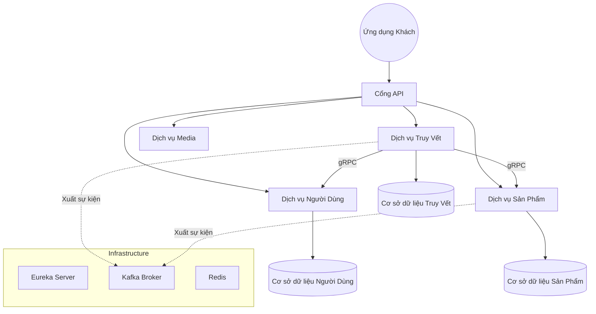
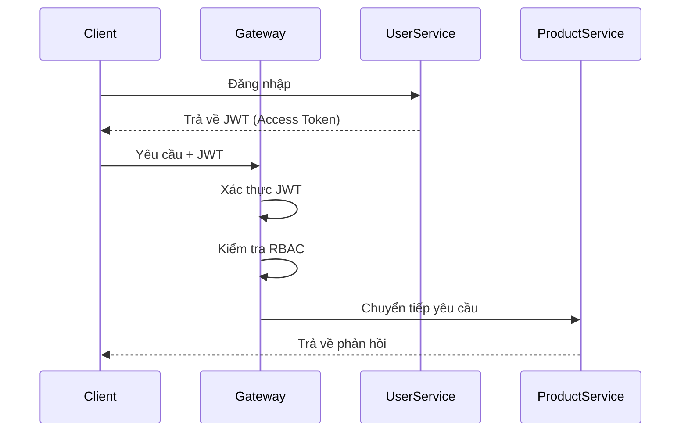

# AgriTrace

> Hệ thống Microservices truy xuất nguồn gốc nông sản với cơ chế chống giả mạo dữ liệu lấy cảm hứng từ Blockchain.


## Tổng quan

**AgriTrace** là đồ án tốt nghiệp được xây dựng nhằm giải quyết bài toán minh bạch chuỗi cung ứng nông sản thông qua kiến trúc **Microservices** kết hợp các cơ chế đảm bảo tính toàn vẹn dữ liệu như:

- SHA-256 Hash Chaining
- RSA Digital Signature
- Immutable Audit Ledger (WORM)
- GPS Geofencing Validation

Khác với các hệ thống CRUD thông thường, AgriTrace được thiết kế theo hướng:

- khó giả mạo dữ liệu
- dễ audit lịch sử thay đổi
- hỗ trợ truy vết xuyên suốt vòng đời sản phẩm
- sẵn sàng mở rộng theo mô hình distributed system

Dự án đồng thời là portfolio backend engineering để ứng tuyển vị trí **Junior Java Backend Developer**.

---

# Bài toán thực tế

Trong chuỗi cung ứng nông sản, dữ liệu thường bị:

- chỉnh sửa thủ công sau khi nhập
- thiếu khả năng truy vết nguồn gốc
- khó xác minh vị trí canh tác thực tế
- thiếu cơ chế audit lịch sử thay đổi

Điều này khiến:

- người tiêu dùng thiếu niềm tin
- doanh nghiệp khó kiểm định chất lượng
- khó xác định trách nhiệm khi xảy ra sự cố thực phẩm

AgriTrace được xây dựng để giải quyết các vấn đề trên bằng tư duy của một hệ thống backend production-oriented.

---

# Điểm nổi bật

## Điểm nổi bật (Backend)

- Kiến trúc Microservices với Database-per-Service
- gRPC communication cho internal services
- Kafka Event-Driven Audit Logging
- JWT Stateless Authentication
- RBAC Authorization
- Hash Chain chống chỉnh sửa dữ liệu hồi tố
- RSA Signature chống giả mạo log
- Geofencing Validation bằng công thức Haversine
- Dockerized Distributed Environment
- Fault-tolerant design với Eureka + Resilience4j

---


# Kiến trúc hệ thống



## Kiến trúc tổng thể

Hệ thống được thiết kế theo mô hình:

- Mẫu Cổng API cho routing tập trung và bảo mật
- Phát hiện dịch vụ (Service Discovery) bằng Netflix Eureka
- Mỗi dịch vụ một cơ sở dữ liệu (Database-per-Service)
- Kiến trúc hướng sự kiện (Event-Driven) cho ghi audit
- Giao tiếp nội bộ bằng gRPC để tối ưu độ trễ

Việc lựa chọn Microservices mang lại:

- Triển khai độc lập
- Mở rộng theo chiều ngang
- Cô lập lỗi (fault isolation)
- Dễ bảo trì khi hệ thống mở rộng

---

# Danh sách dịch vụ (Microservices)

| Dịch vụ | Trách nhiệm |
|---|---|
| Cổng API (API Gateway) | Định tuyến, xác thực JWT, lọc bảo mật |
| Eureka Server | Đăng ký và phát hiện dịch vụ |
| Dịch vụ Người Dùng (User Service) | Quản lý định danh, RBAC, quản lý khóa RSA |
| Dịch vụ Sản Phẩm (Product Service) | Quản lý sản phẩm và lô hàng |
| Dịch vụ Truy Vết (Trace Service) | Ghi nhật ký truy vết, Hash Chain, Geofencing |
| Dịch vụ Media (Media Service) | Tạo mã QR và xử lý media |
| Audit Service | Tiêu thụ Kafka và ghi sổ cái WORM (immutable audit ledger) |

---

# Security & Data Integrity Design

Đây là phần cốt lõi làm AgriTrace khác biệt với các project CRUD thông thường.

## 1. Hash Chaining

Mỗi Trace Log sẽ chứa:

- `previous_hash`
- `current_hash`

`current_hash` được tạo bằng:

```text
SHA256(trace_data + previous_hash)
```

Điều này tạo thành chuỗi liên kết dữ liệu.

Nếu một bản ghi bị chỉnh sửa trực tiếp trong cơ sở dữ liệu:

- hash hiện tại sẽ thay đổi
- toàn bộ chuỗi phía sau sẽ không hợp lệ
- hệ thống phát hiện dữ liệu đã bị can thiệp

---

## 2. Chữ ký số RSA

Sau khi tạo hash:

- hệ thống ký `current_hash` bằng RSA Private Key
- lưu `signature` vào Trace Log
- xác minh bằng Public Key khi đọc dữ liệu

---

## 3. Sổ cái kiểm toán bất biến (WORM)

Mọi thay đổi trạng thái hệ thống đều được đẩy dưới dạng sự kiện vào Kafka.

Audit Service tiêu thụ các sự kiện và ghi vào sổ cái theo cơ chế:

> Ghi một lần, đọc nhiều lần (Write Once Read Many - WORM)

Không cung cấp API để UPDATE hoặc DELETE dữ liệu kiểm toán.

---

## 4. Xác thực vị trí (Geofencing)

Khi Nhà vườn ghi nhật ký canh tác:

- thiết bị gửi tọa độ GPS
- hệ thống tính khoảng cách bằng công thức Haversine
- xác thực theo quy tắc nghiệp vụ

Nếu vượt quá giới hạn:

```text
GeofenceViolationException
```

---

# Luồng xác thực (Authentication)



---

# Công nghệ

## Backend

- Java 21
- Spring Boot 3.3.6
- Spring Security
- Spring Cloud Gateway
- Spring Data JPA
- Spring Cloud Netflix Eureka
- Resilience4j

## Hạ tầng

- PostgreSQL
- Redis
- Apache Kafka
- Docker
- Docker Compose

## Giao tiếp

- REST API
- gRPC
- Kafka (Event Streaming)

---

# Thách thức kỹ thuật

## Vấn đề giao dịch phân tán

Giải quyết bài toán tính nhất quán giữa nhiều dịch vụ bằng:

- Soft Delete
- Kiểm tra chéo giữa các dịch vụ (cross-service validation) bằng gRPC
- Bảo vệ dữ liệu lịch sử (historical data protection)

## Phát hiện dữ liệu bị can thiệp

Nếu DBA sửa trực tiếp cơ sở dữ liệu:

- Hash Chain bị đứt
- Xác thực chữ ký (signature) thất bại
- hệ thống đánh dấu `COMPROMISED`

---

# Cân nhắc về khả năng mở rộng

- API Gateway ở trạng thái stateless
- Mở rộng theo chiều ngang (horizontal scaling)
- Xử lý bất đồng bộ bằng Kafka
- Cô lập theo mô hình Database-per-Service
- Hỗ trợ read-replica

---

# Cài đặt & chạy cục bộ

## Yêu cầu

- Java 21
- Maven
- Docker
- Docker Compose

## Chạy dự án

```bash
git clone https://github.com/your-username/AgriTraceChain.git

cd agritrace-microservices

mvn clean install -DskipTests

docker-compose up -d
```

---

# Cải tiến tương lai

- Triển khai lên Kubernetes
- Thiết lập CI/CD với GitHub Actions
- ElasticSearch/OpenSearch cho phân tích audit
- Hệ thống thông báo thời gian thực
- Dashboard phân tích Distributed Tracing

---

# Những điều tôi đã học

- Thiết kế hệ thống phân tán
- Kiến trúc hướng sự kiện
- Giao tiếp gRPC & Kafka
- Bảo mật JWT & RBAC
- Ứng dụng mật mã học (RSA, SHA-256)
- Docker hóa môi trường

---

# Tác giả

- GitHub: github.com/AcidTSB
- Email: acidg694@gmail.com


---

> “2026, drownincloud.”
